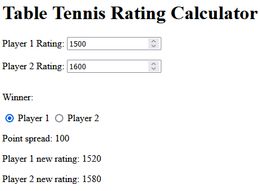

# Table Tennis Rating Calc

A simple web application to calculate rating changes based on the [USATT algorithm](https://usatt.simplycompete.com/info/ratings).

Currently, it only does 1 pass, so it can't be used for unrated players. I might expand upon this in the future.



## Developing

Run `pnpm install`, then you can start a development server with:

```bash
pnpm run dev

# or start the server and open the app in a new browser tab
pnpm run dev -- --open
```

## Building

To create a static production bundle, run the following:

```bash
pnpm run build
```

You can preview the production build with `pnpm run preview`.
